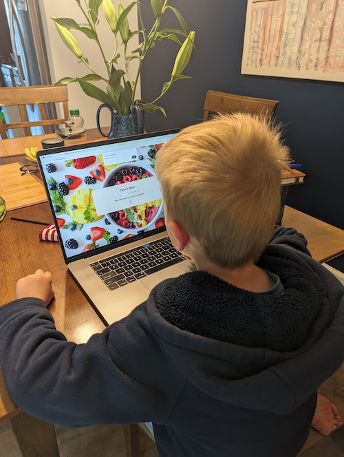

# Calorie-Meter App

## Table of contents

- [Overview](#overview)
  - [Screenshot](#screenshot)
  - [Links](#links)
  - [Available scripts](#available-scripts)
  <!-- - [Built with](#built-with)
  - [What I learned](#what-i-learned)
  - [Continued development](#continued-development) -->
  <!-- - [Useful resources](#useful-resources) -->
- [Author](#author)
<!-- - [Acknowledgments](#acknowledgments) -->

## Overview

This is the beginning of my calorie calculator application.

## Sreenshot

### This is the very first user and tester of this app



### Links

- Github URL: [https://github.com/cvtqx/calorie-counter](https://github.com/cvtqx/calorie-counter)
- Live Site URL: [Add live site URL here](https://your-live-site-url.com)

## Available Scripts

In the project directory, you can run:

### `npm start`

Runs the app in the development mode.\
Open [http://localhost:3000](http://localhost:3000) to view it in your browser.

The page will reload when you make changes.\
You may also see any lint errors in the console.

<!-- ## My process -->

### Built with

- React
- Redux
- Mobile-first workflow
- Edamam Nutrition Analysis API.

<!-- ### What I learned

Use this section to recap over some of your major learnings while working through this project. Writing these out and providing code samples of areas you want to highlight is a great way to reinforce your own knowledge.

To see how you can add code snippets, see below:

```html
<h1>Some HTML code I'm proud of</h1>
```
```css
.proud-of-this-css {
  color: papayawhip;
}
```
```js
const proudOfThisFunc = () => {
  console.log('🎉')
}
``` -->

<!-- ### Continued development

Use this section to outline areas that you want to continue focusing on in future projects. These could be concepts you're still not completely comfortable with or techniques you found useful that you want to refine and perfect.

**Note: Delete this note and the content within this section and replace with your own plans for continued development.** -->

<!-- ### Useful resources

- [Example resource 1](https://www.example.com) - This helped me for XYZ reason. I really liked this pattern and will use it going forward.
- [Example resource 2](https://www.example.com) - This is an amazing article which helped me finally understand XYZ. I'd recommend it to anyone still learning this concept.

**Note: Delete this note and replace the list above with resources that helped you during the challenge. These could come in handy for anyone viewing your solution or for yourself when you look back on this project in the future.** -->

## Author

- Website - [Olga Yudkin](https://www.olgayudkin.com)
- Frontend Mentor - [@cvtqx](https://www.frontendmentor.io/profile/cvtqx)
- LinkedIn - [Olga Yudkin](https://www.linkedin.com/in/olga-yudkin/)

<!-- ## Acknowledgments

This is where you can give a hat tip to anyone who helped you out on this project. Perhaps you worked in a team or got some inspiration from someone else's solution. This is the perfect place to give them some credit.

**Note: Delete this note and edit this section's content as necessary. If you completed this challenge by yourself, feel free to delete this section entirely.** -->
